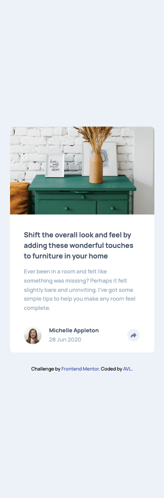
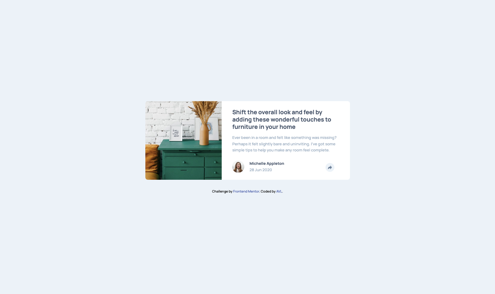
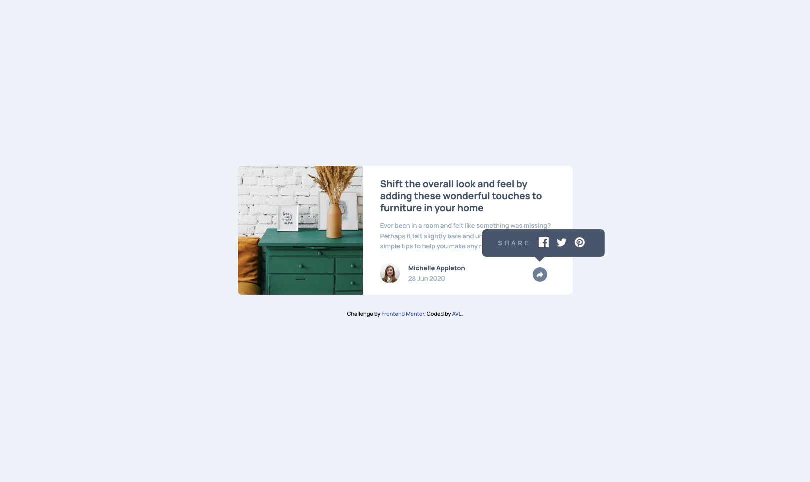

# Frontend Mentor - Article preview component solution

This is a solution to the [Article preview component challenge on Frontend Mentor](https://www.frontendmentor.io/challenges/article-preview-component-dYBN_pYFT). Frontend Mentor challenges help you improve your coding skills by building realistic projects.

## Table of contents

- [Overview](#overview)
  - [The challenge](#the-challenge)
  - [Screenshot](#screenshot)
  - [Links](#links)
- [My process](#my-process)
  - [Built with](#built-with)
  - [What I learned](#what-i-learned)
  - [Continued development](#continued-development)
  - [Useful resources](#useful-resources)
  - [AI Collaboration](#ai-collaboration)
- [Author](#author)

## Overview

This project is a solution to the Frontend Mentor Article preview component challenge. The goal was to build a responsive Article preview component that matched the designs provided.

### The challenge

Users should be able to:

- View the optimal layout for the component depending on their device's screen size
- See the social media share links when they click the share icon

### Screenshot

### Links

- Github URL: https://github.com/arielvonlestat/Article-Preview-Component

- Live Site URL: https://arielvonlestat.github.io/Article-Preview-Component/

## My process

Oh boy, this was a doozy but in the best way. I actuallty learned quite a bit and therefore I put more information regarding that in the "What I learned" section so if you want more details, check that out! As always I started with the mobile layout and worked my way to desktop. I had a firm rule not to use AI for the CSS because I wanted to see what I could and could not do on my own. I was sucessful with that, except for one thing (the arrow below the pop up menu on desktop). The rest, I did without the help of AI.

The Javascript I was very much lacking on with learning, so I had to use it more for that. I will summerize what I have stated below in the "What I learned" section.

I created variables that I conneted to classes with the HTML document (.share, .share-menu, .share-text).

I created two seperate functions both using .addEventListener to listen for the click of the button. In one I used .classList.toggle to toggle on and off the button/menu. In the other, I used it to tell people they had found an easter egg. Within that same function, I created a variable with the navigator.userAgent object/method.

Then used the variable with .includes to write an if, else if, else statement to determined based on the user's browswer what easter egg they would get.

If it wasn't a URL I used a prompt to explain to the user what they needed to do.

If it was a URL I used window.location.href = 'website'

In one of the easter eggs I used a prompt to instruct them what to do and the window.location.href = 'website' to take them to the website to do it.

### Built with

- Semantic HTML5 markup
- CSS custom properties
- Flexbox
- CSS Grid
- Mobile-first workflow
- JavaScript

### What I learned

I learned so very much here. As i've talked about in different readme files I was trying to get a solid baseline with CSS before I moved on to Javascript. I then eventually did move on and have used many resources for it (as I have listed below). That being said, i'm not sure I was fully equiped to do the Javascript on this challege as I didn't even know how to give Javascript access to the HTML (I knew how to connect it but not give it access). I learned the following:

document.querySelector();

Which allowed me to choose a class from the HTML that I could then manipulate. I also learned that I could do this with IDs and even standard HTML elements (like p, h1, etc). I had already known about variables and their creation so I used the above to create the following:

const shareButton = document.querySelector(“.share”);

I had already knew about functions and how they worked, however I learned about the method addEventListener(), which allowed me to tell Javascript to perform an action when it hears a click. I used this method to use another new method I learned which was classList.toggle(). This allowed me to toggle on and off certain parts of my CSS when Javascript heard the click.

shareButton.addEventListener("click", () => {
shareMenu.classList.toggle("active");
shareButton.classList.toggle("active");
});

I then learned that I could take these "active" states and style them seperately with .share.active (for example). That way I could style the active part in CSS but leave the inactive part alone.

So that I could practice, I added anchor tags on the social media icons to make them link to the respective websites & when I did so I realized that I wanted to do something with the word "share". I thought I couldn't share something from this but maybe I could do a fun Easter Egg & so that's what I focused my energy on to practice some more Javascript. As I went down the rabbit hole trying to figure out what kind of easter eggs to use, I found out that different browsers have different easter eggs. I decided to run with this idea and use if, else if, & else to make different easter eggs for different browsers. I learned about the object/method navigator.userAgent. I learned that this allowed me to get information from the browswer and tell Javascript to look for a keyword.

I used all of this to create a variable that would be equal to navagator.userAgent & then use that with yet another method I learned called .includes. This checks if an array or a string is Boolean (true or false). Perfect for my if, else if, & else! My process is below:

const easterEGG = navigator.userAgent; (created the variable)

easterEGG.includes() (then used .includes with my variable & put my keyword or string within the parentesis)

Originally, I wanted to send people to different websites depending on their browswer, however (without giving any of my easter eggs away) I realized that some of the easter eggs weren't strictly URLs and therefore I could not do what I had originally intended to do. I used promts & alerts to fix this problem (of which I already knew of). Finally, I learned that I could use window.location.href = "URL" to send someone to another website when they click that specific button.

As I said, I learned a ton!

As a side note: I did learn that you have to be careful with navigator.userAgent.includes() because many different browsers can have similar words, so you must be careful what you choose to use. For example, I learned that when you are on Firefox but mobile it actually doesn't bring up Firefox it brings up Safari (even though you are using Firefox). I used the DevTools for mobile and found it not only said I was in Safari but said I was an iPad. So just be careful with this or you could have unexpected results! If you wanna check what Javascript is seeing (what keywords you may use) you can type in navigator.userAgent into the console on DevTools. This is what Javascript searches with this object/method.

### Continued development

### Useful resources

- [Colt Steele - The Web Developer Bootcamp 2026](https://www.udemy.com/) - I have mentioned this course before but Colt does an excellent job of breaking things down in his Bootcamp course. I watched much of his Javascript tutorials before moving on to other methods of learning. These are videos but also there are exercises that you do to practice what you have learned. It was extremely helpful for overall concepts and allowed me to take lots and lots of notes.

- [codeCademy](https://www.codecademy.com/) - Funny enough, I had gotten this as a way to get a break from the endless video tutorials. However, for whatever reason with the CSS I just stopped using it completely. I came back to it for Javascript (again, to take a break from the videos) and I have to say it was very very helpful. It gave me an awesome interactive way to learn that wasn't just watching videos.

- [Edabit Interactive Tutorial](https://edabit.com/tutorial/javascript) - I found this on Google. It is very short and sweet for vanilla Javascript but I feel like going through it and interacting with it helped cemenet my knowledge.

- [Code Combat](https://codecombat.com/) - Continuing on my quest to find a break from the endless videos, or really endless learning in general & trying to just make it fun. I found this. You don't get many free ones but I decided to do a single month and it is a very fun way to keep cementing what you've learned but have a little fun with it! Not sure if I will keep it but i'm trying it out and so far it's fun.

### AI Collaboration

- What tools did you use (e.g., ChatGPT, Claude, GitHub Copilot)?

I used ChatGPT but ONLY for the Javascript potions (and one sigular CSS item).

- How did you use them (e.g., debugging, generating boilerplate, brainstorming solutions)?

I am always very careful in the way that I use it. I do not want it doing the work for me and therefore I only ask it specific questions to understand better. Typically overall concepts, or generalized ideas. I am careful not to ask it to just completely do something for me as I do not feel like I learn that way. If it does give me more information than I want (which it has from time to time) then I spend a lot of time understanding why the answer or concept works and if it doesn't explain it in a way I can understand I asked questions to make sure I understand it.

Admittedly, when I started this challenge I knew many basic vanilla Javascript items but I was getting bored with videos etc and wanted to do something with it. So that being said there was a lot I did know, up to and including how to even give Javascript access to the HTML document so that I could modify things. So I looked up only what was necessary & then used concepts that I already knew to do it completely on my own.

- What worked well? What didn't?

I feel like this is probably the best that i've ever used ChatGPT. I never felt like it was ever just giving me the answers and I asked questions and took detailed notes to understand ever aspect of every new method, object, etc that I learned. I don't think anything really didn't work, which is really saying something because i've had lots of issues in the past.

## Author

- Frontend Mentor - [ArielVonLestat](https://www.frontendmentor.io/profile/arielvonlestat)
